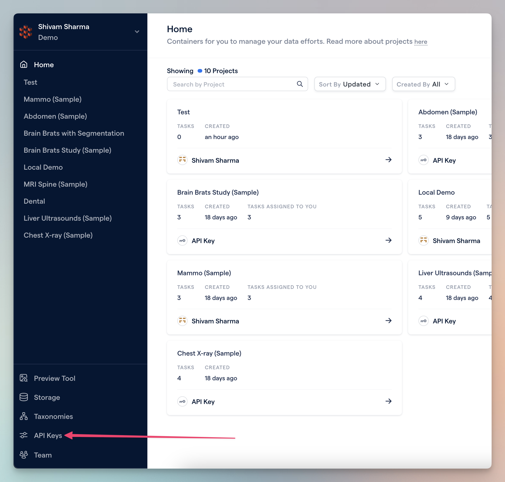
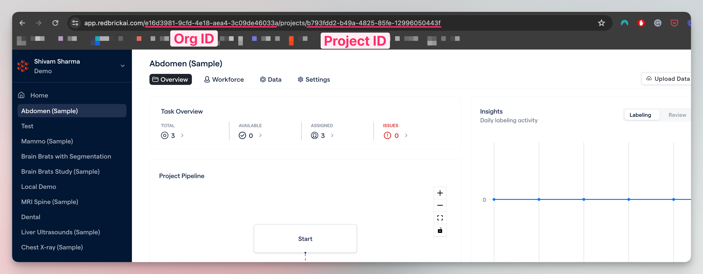

======================================
RedBrick AI SDK and CLI
======================================
RedBrick AI is a SaaS platform for annotating medical images. RedBrick AI provides web based annotation tools, quality control capabilities, collaboration tools, and SDK/CLI to integrate with MLOps.

.. important:: Please visit our `website <https://redbrickai.com>`_ to learn more about RedBrick AI, or request for a free-trial. You can visit the platform documentation here `<https://docs.redbrickai.com/>`_.

The RedBrick AI SDK and CLI are useful for managing data IO operations, and programmatically interacting with the application. The CLI is best for simple operations like import and export; whereas, the SDK is best for complex operations like importing annotations, searching through data, etc.

**Installation**

The SDK and CLI are available on PyPI and can be installed using `pip`.

.. code:: bash

   $ pip install redbrick-sdk

**Authentication**

To use the SDK and CLI, you need a API key. You can fetch the API key from the RedBrick AI dashboard, found on the right sidebar "API keys".

**Organization and project ID's**

For most methods in the CLI and SDK you will need a Project and/or Organization ID. These can be found from the URL.

Python SDK
================================
The SDK is best for writing Python scripts to interact with your RedBrick AI organization & projects. The SDK offers granular
functions for programmatically manipulating data, importing annotations, assigning tasks, and more.

.. card::
   :link: sdk
   :link-type: ref

   :material-regular:`link;1.5rem;sd-mr-2` See the :ref:`sdk` documentation for more information.

.. toctree::
   :hidden:
   :maxdepth: 2

   sdk

Command Line Interface
=======================================
The RedBrick CLI offers a simple interface to quickly import and export your images & annotations, and perform other high-level actions.

.. card::
   :link: cli
   :link-type: ref

   :material-regular:`link;1.5rem;sd-mr-2` See the :ref:`cli` documentation for more information.

.. toctree::
   :hidden:
   :maxdepth: 2

   cli

Formats
===================
Formats for importing & exporting data, and interfacing with various entities on RedBrick AI.

.. card::
   :link: formats
   :link-type: ref

   :material-regular:`link;1.5rem;sd-mr-2` See the :ref:`formats` documentation for more information.

.. toctree::
   :hidden:
   :maxdepth: 2

   formats/index
